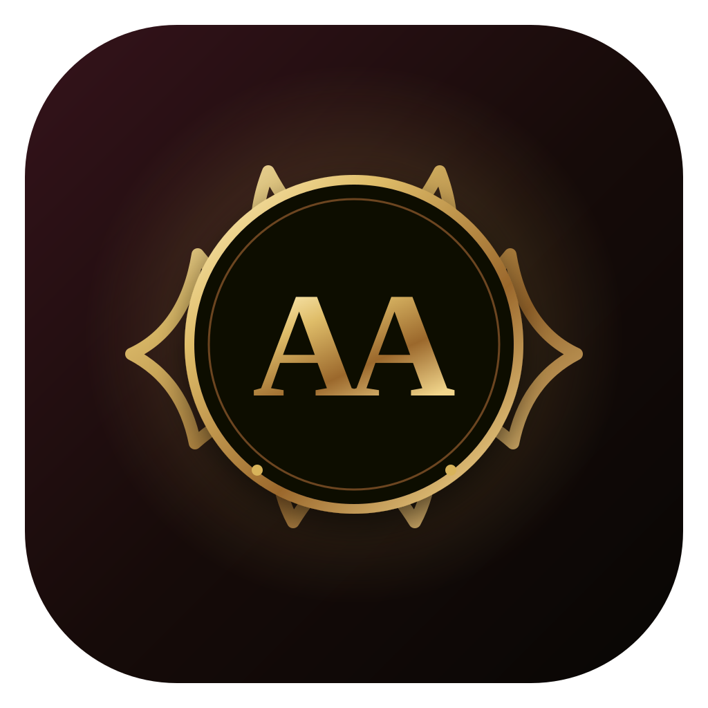
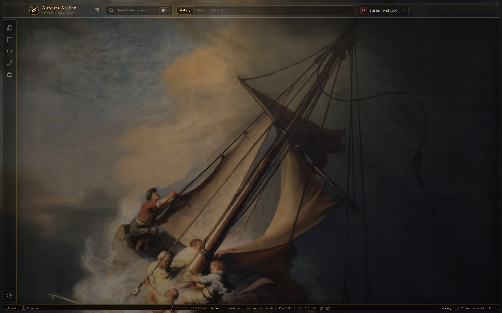
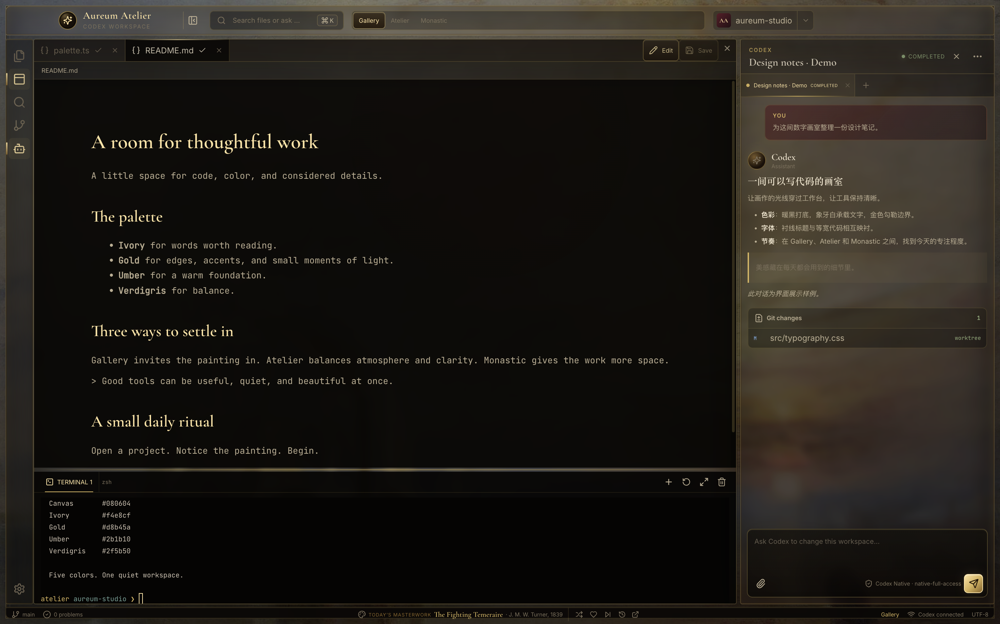
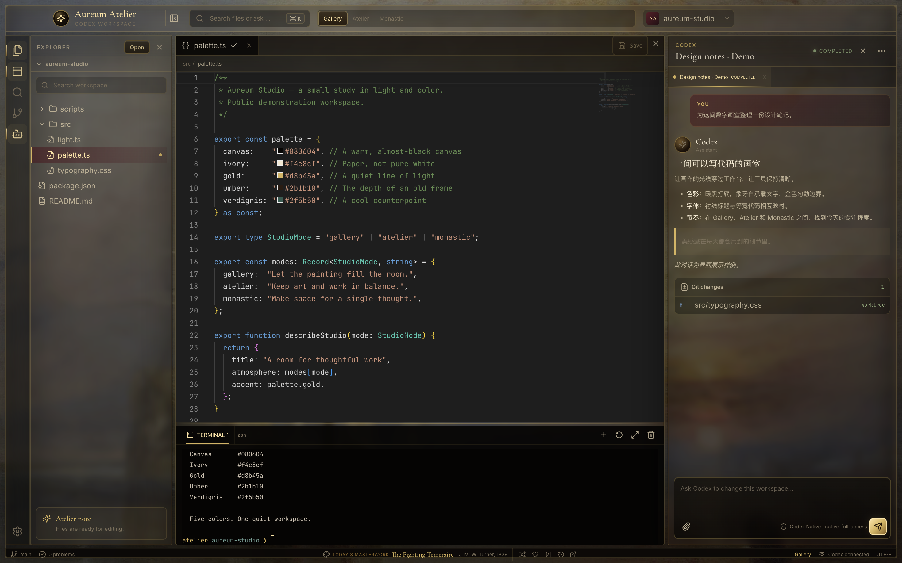
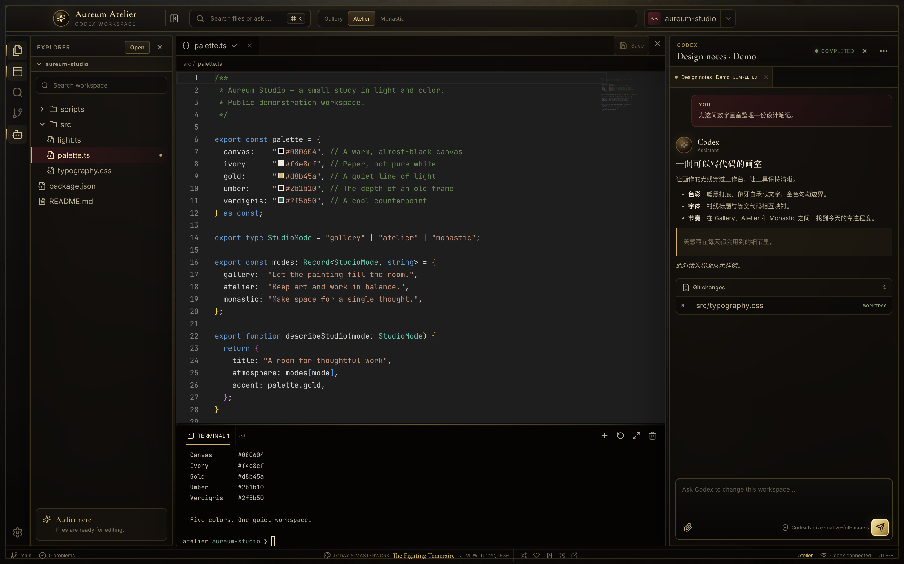
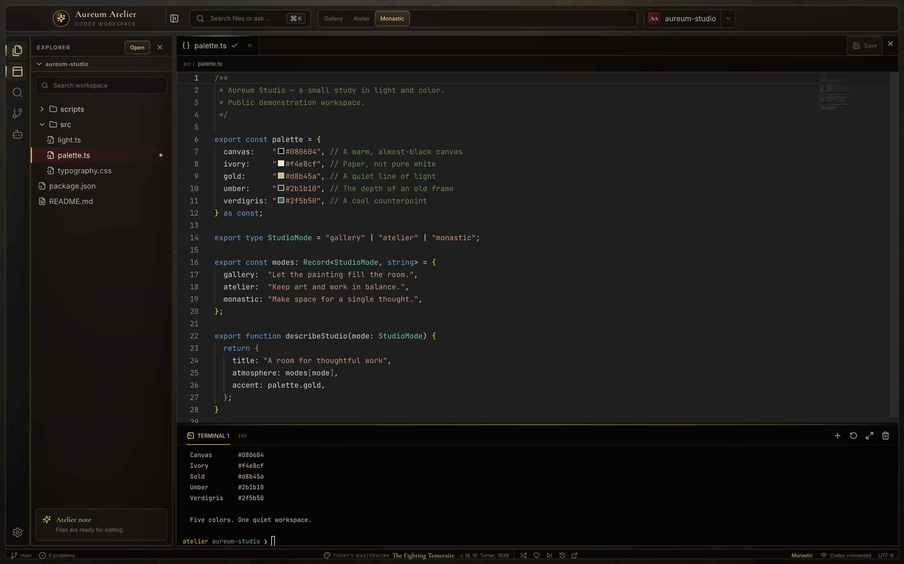
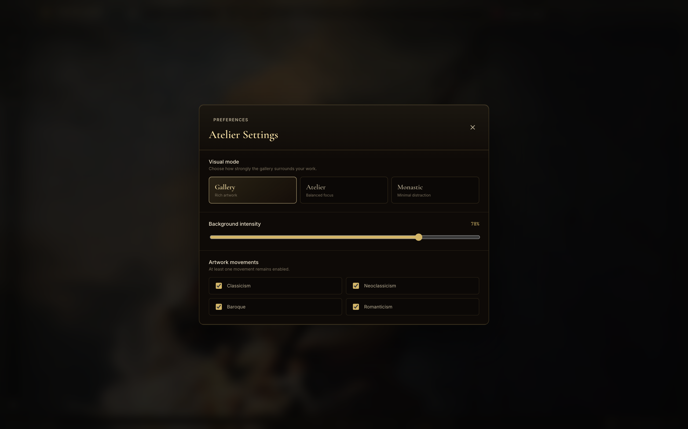
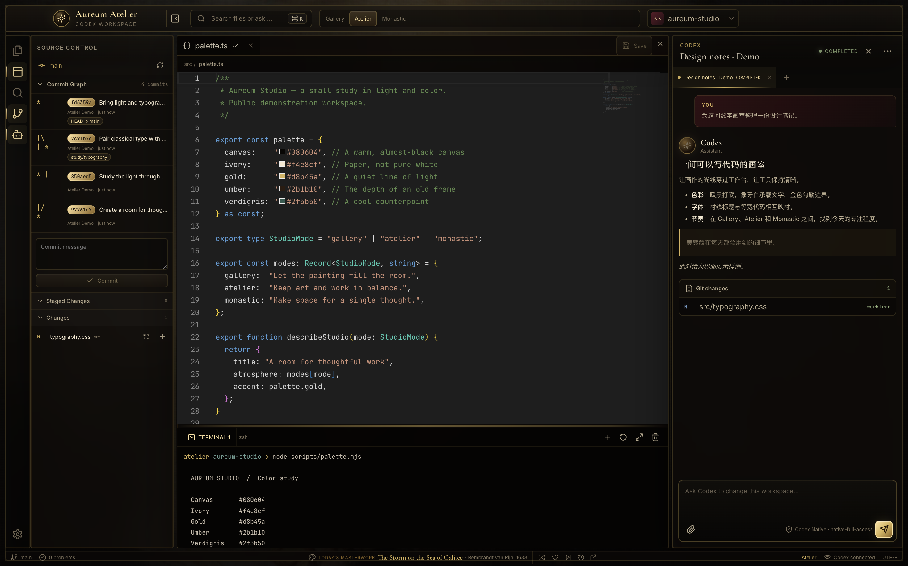

<p align="center">
  
</p>

<h1 align="center">Aureum Atelier</h1>

<p align="center"><strong>一间被名画照亮的数字画室。</strong><br />A quieter place to write code.</p>

<p align="center">名画背景 · 暖金界面 · 本地编辑 · Codex 对话 · 终端与 Git</p>



*Gallery · 收起侧栏、编辑器与 Codex 面板后的画廊视野。背景为 Rembrandt 的 The Storm on the Sea of Galilee。*

Aureum Atelier 是一款以美术馆为灵感的 Codex 桌面编程工作台。打开项目时，画作的光线也进入了工作空间；文件、代码、对话与终端，则被安放在暖黑色与细金线构成的界面里。

你可以在画作前整理思路，也可以展开工具，继续写代码、检查改动、与 Codex 协作。它希望让每天长时间停留的地方，多一点值得细看的东西。

> 以下 7 张图片均为实际运行的 Electron 应用原生截图，原图尺寸为 2940 × 1836。工作区、提交记录及标注为 Demo 的对话使用专门准备的展示样例；画面保留了应用原有的配色、排版和布局。

## 美感，落在每天都会用到的细节里

**暖黑、象牙白与旧金色。** 接近黑色的棕调铺底，柔和的象牙白承载文字，金色用在边框、选中状态与小小的操作图标上。细线、内阴影和半透明面板，让界面有一点画框与玻璃的质感。

**三种字体，各有位置。** Cormorant Garamond 赋予标题古典的衬线轮廓，Inter 负责清晰的界面文字，JetBrains Mono 则保持代码和终端的整齐节奏。阅读、操作与编程，共用一套克制的视觉语言。

**让画作参与空间。** 背景中的颜色透过面板，在工作台的边缘留下光影；模式切换与强度调节决定它离你的工作有多近。



*阅读与构思 · Markdown 预览中的衬线标题，与右侧对话面板相互呼应；侧栏已手动收起，让文字拥有更宽的空间。*

## 三种主题，三种专注的姿态

| 模式 | 视觉气质 | 适合的时刻 |
| --- | --- | --- |
| **Gallery** | 更通透的面板，更鲜明的名画光影 | 浏览、构思、轻量编辑，或单纯停下来看看画 |
| **Atelier** | 更沉稳的面板，把文字与工具的层次拉开 | 日常开发、阅读代码、与 Codex 协作 |
| **Monastic** | 收敛装饰，降低画面的色彩饱和度 | 想让视觉环境安静一些的专注时段 |

### Gallery · 让光线进入工作台

Turner 的 The Fighting Temeraire 为这一幕带来暮色般的暖调。文件树、代码和对话依然各就其位，画作则从面板之间透出来，让工作台保留一种有空气、有光线的感觉。



### Atelier · 把画室留在身边，把代码放在眼前

切换到 Atelier，同一幅画、同一份代码有了更安定的背景。更深的面板衬出内容，细金线仍保留着画室的轮廓，适合把注意力放到一段实现或一次讨论上。



### Monastic · 为一件事留出空间

Monastic 减弱装饰和画作的色彩。再按当前需要收起部分面板，编辑器就可以获得更宽的空间。模式决定氛围，面板的取舍由你决定。



*此图手动收起了 Codex 面板；切换主题本身不会自动隐藏工作面板。*

## 每天一幅画，也可以有自己的偏爱

内置 **60 幅名画**，涵盖古典主义、新古典主义、巴洛克与浪漫主义。每日轮换之外，你还可以切换下一幅、收藏喜欢的作品、跳过不想再出现的画，或从最近浏览的作品中回到某一幅。

底栏像一张小小的展签，保留作品名、作者、年代和来源入口。背景强度可在 **0–100%** 之间调节，设置里也可以选择参与轮换的艺术流派。



*自己的画室，自己的光线 · 从主题到背景强度，把氛围调到适合今天工作的程度。*

## 从审美日常，回到认真工作

这一套界面也容纳了完整的日常工作路径：打开本地文件，编辑代码，运行命令，检查 Git 改动，再继续与 Codex 讨论。



*Source Control · 示例仓库中的真实分支与合并记录；历史、当前改动和正在编辑的文件可以并排查看。*

| 工作环节 | 已有能力 |
| --- | --- |
| **打开与编辑** | 本地目录树、工作区搜索、Monaco 编辑器、文件保存与 Markdown 预览 |
| **与 Codex 协作** | 基于本机 app-server 的多会话、流式消息、工作区上下文与审批事件交互 |
| **带上参考内容** | 图片、视频关键帧与文档内容解析；实际理解能力取决于所用模型 |
| **运行与检查** | 基于 node-pty 和 xterm.js 的集成终端、文件差异、暂存与提交、Git 历史图 |
| **整理桌面** | 可折叠的侧栏、编辑器与对话面板，可调节的面板宽度与终端高度 |

基于 **Electron · React · TypeScript · Monaco · xterm.js** 构建。源码采用 MIT 许可证，欢迎把这间画室继续改成你喜欢的样子。

---

## 本地运行

项目目前以 **macOS** 为主要开发和打包平台，版本为 `0.1.0`。Windows/Linux 尚未完成验证。

需要 Node.js 22.13+、npm、Git 和 ripgrep（`rg`，用于工作区搜索）。Codex 功能还需要自行安装并完成认证的 Codex CLI；它不包含在本仓库中。

```bash
git clone https://github.com/pivoine-maker/aureum-atelier.git
cd aureum-atelier
npm ci
npm run dev
```

安装过程中会下载 Electron、FFmpeg 等依赖。内置名画已经随源码提供，无需先运行素材下载脚本。

### Codex 配置

应用复用本机 Codex 的认证、模型和配置。先确保终端中的 Codex 可以正常运行：

```bash
codex --version
codex app-server --help
```

当前桥接使用 `codex -c features.code_mode_host=false app-server --stdio`，依赖实验性的 app-server 协议。发布准备时检查的本机 CLI 版本为 `0.146.0`；不同版本的协议支持可能不同。目标、技能及 Guardian 审批等功能也取决于对应 CLI 和服务端能力。Aureum Atelier 是独立项目，与 OpenAI 无隶属关系。

如应用找不到 Codex，可在启动前指定可执行文件：

```bash
CODEX_BINARY=/absolute/path/to/codex npm run dev
```

使用自建 LiteLLM 代理时，桥接会继承 `LITELLM_PROXY_API_KEY`，或读取 `AUREUM_LITELLM_PROXY_API_KEY`。代码中的 `aureum-local` 是本地回退占位值，不提供任何托管服务访问权限。真实密钥由使用者在本机配置。

## 开发与验证

```bash
npm test -- --run     # 单元与组件测试
npm run typecheck    # TypeScript 类型检查
npm run build        # 构建 Electron 主进程、preload 与渲染界面
npm run verify       # 按顺序运行以上三项
```

macOS 本地打包：

```bash
npm run pack:mac     # release/ 下生成应用目录
npm run dist:mac     # release/ 下生成 DMG 和 ZIP
```

现有打包配置不包含 Developer ID 签名或公证。仓库发布的是源码；自行分发安装包前需配置签名、公证，并保留依赖要求的版权与许可证文件。

## 项目结构

```text
src/main/          Electron 主进程、Codex、终端、文件与 Git 服务
src/preload/       主进程和渲染界面的 IPC 桥接
src/renderer/      React 界面、编辑器、主题与内置名画
src/shared/        共享类型、校验与名画目录
scripts/           原生依赖修复、素材下载与界面预览辅助脚本
build/             应用图标
docs/superpowers/  开发过程中的设计说明与实现计划
```

设计文档保留了项目演进过程，部分描述属于历史方案；当前行为以源码和测试为准。`preview:capture` 使用独立的模拟界面数据，不能替代真实 Codex 对话验证。

需要重新生成名画离线缩略图时，安装 ImageMagick（提供 `magick` 命令），再运行 `npm run artworks:download`。此命令从目录所列的来源下载图片，部分 Wikimedia 图片会经由 wsrv.nl 代理。

## 数据与权限

工作区文件由应用在本机读取和保存；设置与附件缓存保存在 Electron 用户数据目录。发送的消息、上下文和附件会交给所配置的模型服务处理。

**当前 Codex 桥接显式设置 `approvalPolicy: "never"` 和 `sandbox: "danger-full-access"`**，并继承启动应用时的环境。这允许模型发起的操作使用当前用户的本机权限，通常不会逐项请求确认；选择一个工作区不等同于文件系统隔离。请仅在受信任的工作区和模型配置下使用，或先调整 `src/main/codex/codexExecService.ts` 中的 `codexPermissionParams()`。界面中的审批事件支持取决于 CLI，不构成操作必定需要确认的保证。

## 许可证与素材

项目原创代码采用 [MIT License](LICENSE)。名画、字体、FFmpeg 和其他第三方依赖保留各自的许可条件，不因本项目的 MIT 许可证而改变。完整名画来源和直接依赖说明见 [THIRD_PARTY_NOTICES.md](THIRD_PARTY_NOTICES.md)。

欢迎通过 [Issues](https://github.com/pivoine-maker/aureum-atelier/issues) 报告问题，或提交 Pull Request。提交前请运行 `npm run verify`，并避免加入个人配置、凭据或工作区内容。
