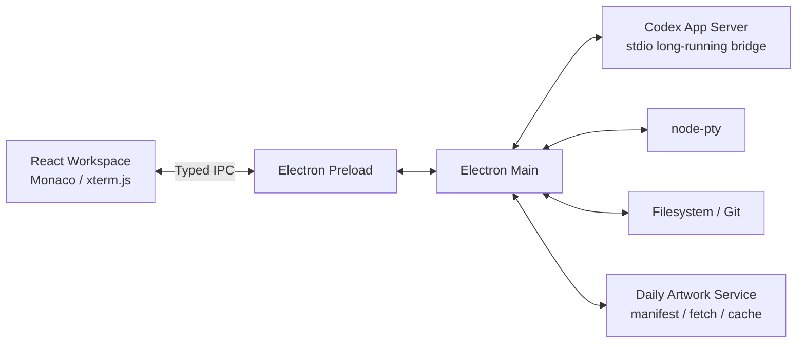

# Aureum Atelier Design Specification

## Summary

Aureum Atelier is an Electron + React desktop IDE for Codex users. It combines a full AI coding workspace with a classical fine-art visual system: daily public-domain oil paintings as adaptive backgrounds, gilded interface treatments, and a productivity-first editor shell.

The product should feel like a private neoclassical atelier: elegant, warm, artful, and dramatic, while still remaining highly readable for long coding sessions.

## Goals

- Provide a full workspace IDE centered on AI-assisted development.
- Integrate with the local Codex installation instead of reimplementing model authentication or agent logic.
- Support file browsing, editing, diffing, Git, integrated terminal, and Codex task workflows.
- Display a daily rotating historical oil painting background, similar to browser daily wallpaper themes.
- Use a coherent gilded design language for panels, buttons, borders, focus rings, menus, and status surfaces.
- Keep visual richness optional through focus modes and background intensity controls.

## Non-Goals For Initial Release

- Rebuilding a full VS Code replacement.
- Debugger support.
- Plugin marketplace.
- Remote development.
- Multi-user collaboration.
- Custom model proxying or API key management.
- Bundling copyrighted paintings without verified license metadata.

## Product Architecture



### Main Areas

- Left rail: workspace switcher, file tree, search, Git, Codex task history.
- Center: Monaco editor tabs, diff views, Markdown preview, image preview.
- Right rail: Codex conversation, plan, tool calls, approvals, changed files.
- Bottom panel: integrated terminal tabs, problems, command output.
- Background layer: daily painting, adaptive crop, dark readability scrim, optional blur.
- Status bar: current artwork title, artist, year, movement, museum, Codex status, Git branch.

## First Release Scope

### Workspace IDE

- Open a local folder as a workspace.
- Render a virtualized file tree.
- Open, edit, save, and close files in editor tabs.
- Monaco syntax highlighting and basic editor settings.
- Side-by-side diff view.
- Markdown preview.
- Image preview.
- Workspace search through ripgrep.
- Recent workspaces.
- Keyboard shortcuts for common IDE actions.

### Terminal

- Integrated xterm.js terminal.
- Multiple terminal tabs.
- Per-terminal working directory.
- Restart and kill terminal sessions.
- Environment inheritance from app launch context where safe.

### Git

- Show Git branch and working tree status.
- Show changed files.
- Open diffs for modified files.
- Stage and unstage files.
- Revert selected file changes with confirmation.
- Commit UI can be added late in M4 if core workflows are stable.

### Codex Workbench

- Detect local `codex` binary.
- Detect Codex version and minimum compatibility.
- Start and supervise `codex app-server` using stdio.
- Generate TypeScript protocol bindings from `codex app-server generate-ts` during development.
- Create a new task in the current workspace.
- Resume a task when supported by the app-server protocol.
- Stream assistant output and structured events.
- Render plans, tool calls, approvals, and changed file lists.
- Stop an active task.
- Reconnect after app-server restart when possible.
- Fall back to `codex exec --json` for basic prompt execution if app-server is unavailable.

### Daily Artwork

- Pick one deterministic artwork per calendar day.
- Support manual shuffle, favorite, skip, and history.
- Cache artwork images locally.
- Prefetch at least 7 days of future artworks.
- Show artwork metadata and source link.
- Provide filters by movement and sensitivity category.
- Provide background intensity and focus modes.

## Visual System

### Theme Name

Aureum Atelier / 金典画室

### Design Principles

- The interface should feel like a classical art studio, not a novelty skin.
- Gold is an accent and material, not a flat fill color everywhere.
- Layout should remain symmetrical and calm, inspired by neoclassical order.
- Background paintings must recede behind content.
- Editor readability takes priority over visual spectacle.
- Every decorative effect needs a low-distraction fallback.

### Modes

- Gallery: full artwork background, strongest gilded treatment, suitable for browsing and presentation.
- Atelier: reduced artwork opacity and moderate decoration, default for daily coding.
- Monastic: hidden artwork and minimal decoration, suitable for deep focus or poor lighting.

### Color Tokens

```ts
export const aureumTheme = {
  color: {
    canvas: "#080604",
    panel: "rgba(19, 14, 10, 0.78)",
    panelStrong: "rgba(27, 19, 12, 0.92)",
    panelSoft: "rgba(255, 244, 218, 0.055)",

    ink: "#F4E8CF",
    inkMuted: "#BDAF92",
    inkFaint: "#7D705A",

    gold: "#D8B45A",
    goldBright: "#FFE3A1",
    goldDeep: "#8A6424",
    goldShadow: "#3B2609",

    burgundy: "#4B121C",
    lapis: "#17223B",
    umber: "#2B1B10",
    verdigris: "#2F5B50",

    danger: "#D45A4C",
    success: "#7FA35A",
    warning: "#D8A84A",
    info: "#6D91B8",
  },
};
```

### Surface Treatment

- Panels use translucent dark umber glass with blur and low saturation.
- Borders use a dual gilded treatment: dark gold outer structure and bright gold top highlight.
- Buttons use dark bodies with fine gold rims, inner highlights, and restrained hover glow.
- Focus rings use warm gold rather than blue.
- Selected states use burgundy or lapis fills with a single gilded leading edge.
- Separators use one-pixel dark gold with local highlights, not continuous bright lines.
- Background noise and subtle canvas texture can be used on panels, but must remain barely visible.

### CSS Reference

```css
.aureum-panel {
  background:
    linear-gradient(180deg, rgba(255, 229, 164, 0.06), transparent 28%),
    rgba(18, 12, 8, 0.78);
  border: 1px solid rgba(216, 180, 90, 0.38);
  box-shadow:
    inset 0 1px 0 rgba(255, 227, 161, 0.18),
    0 18px 48px rgba(0, 0, 0, 0.42);
  backdrop-filter: blur(22px) saturate(0.9);
}

.aureum-button {
  color: #ffe3a1;
  background:
    linear-gradient(180deg, rgba(255, 227, 161, 0.12), rgba(138, 100, 36, 0.06)),
    #1b130c;
  border: 1px solid rgba(216, 180, 90, 0.56);
  box-shadow:
    inset 0 1px 0 rgba(255, 244, 218, 0.18),
    0 0 0 1px rgba(59, 38, 9, 0.55);
}

.artwork-layer {
  background-size: cover;
  background-position: center;
  filter: saturate(0.82) contrast(0.92) brightness(0.62);
}

.artwork-scrim {
  background:
    radial-gradient(circle at 50% 20%, rgba(255, 214, 126, 0.12), transparent 36%),
    linear-gradient(90deg, rgba(4, 3, 2, 0.88), rgba(4, 3, 2, 0.58), rgba(4, 3, 2, 0.86)),
    linear-gradient(180deg, rgba(4, 3, 2, 0.48), rgba(4, 3, 2, 0.92));
}
```

### Typography

- UI font: Geist or Inter.
- Code font: Geist Mono or JetBrains Mono.
- Artwork and decorative titles: Cormorant Garamond or Libre Baskerville.
- Decorative serif usage must be limited to metadata, headings, and onboarding surfaces.

## Daily Artwork System

### Source Strategy

Use public-domain or openly licensed sources first:

- The Metropolitan Museum of Art.
- Art Institute of Chicago.
- Rijksmuseum.
- Cleveland Museum of Art.
- National Gallery of Art.
- Wikimedia Commons only as a secondary source with strict license validation.

### Movement Coverage

The first curated library should cover:

- Classicism and late Renaissance-adjacent classical painting.
- Baroque.
- Neoclassicism.
- Romanticism.

Representative artists include Raphael, Nicolas Poussin, Claude Lorrain, Caravaggio, Rembrandt, Rubens, Velázquez, Vermeer, Jacques-Louis David, Ingres, Delacroix, Géricault, Turner, Caspar David Friedrich, and Goya.

### Eligibility Rules

- Artwork must be public domain, CC0, or a clearly acceptable open license.
- Image should have at least 2400 px on the long edge.
- Landscape composition is preferred.
- Images with very high luminance or poor readability should be downranked.
- Potentially sensitive content should be taggable and filterable.
- Each record must preserve museum/source URL and license metadata.

### Artwork Schema

```ts
export type Artwork = {
  id: string;
  title: string;
  artist: string;
  year?: string;
  movement: "classicism" | "neoclassicism" | "baroque" | "romanticism";
  museum: string;
  sourceUrl: string;
  imageUrl: string;
  license: "public-domain" | "cc0" | "cc-by";
  dominantColors: string[];
  luminanceScore: number;
  composition: "landscape" | "portrait" | "square";
  tags: string[];
};
```

### Daily Selection

```ts
export function pickDailyArtwork(date: Date, library: Artwork[], preferences: UserPrefs) {
  const dayKey = date.toISOString().slice(0, 10);
  const seed = hash(`${dayKey}:${preferences.rotationSalt}`);

  return seededShuffle(library, seed)
    .filter((art) => preferences.enabledMovements.includes(art.movement))
    .filter((art) => !preferences.skippedArtworkIds.includes(art.id))
    .filter((art) => art.luminanceScore <= preferences.maxLuminance)[0];
}
```

### Local Storage

- `~/Library/Application Support/Aureum Atelier/artworks/library.json`
- `~/Library/Application Support/Aureum Atelier/artworks/images/{id}.jpg`
- `~/Library/Application Support/Aureum Atelier/app.db`

### Cache Policy

- First launch includes a fallback set of public-domain bundled artwork records.
- On first successful network access, refresh the artwork library.
- Prefetch 7 future candidates immediately.
- Prefetch up to 30 future candidates while idle.
- Prune image cache by LRU when a user-configurable size limit is exceeded.
- If offline, use the selected cached artwork or a favorite/fallback artwork.

### Presentation Metadata

```ts
export type ArtworkPresentation = {
  cropFocus: { x: number; y: number };
  overlayOpacity: number;
  blurForPanels: number;
  accentGoldBias: number;
  suggestedPanelTone: "umber" | "burgundy" | "lapis";
};
```

## Technical Stack

- Electron.
- React.
- TypeScript.
- electron-vite.
- Monaco Editor.
- xterm.js.
- node-pty.
- Zustand.
- TanStack Query.
- Zod.
- better-sqlite3.
- simple-git or direct Git CLI wrappers.
- Vitest.
- Playwright for Electron E2E.
- electron-builder.

## Repository Structure

```text
aureum-atelier/
├── apps/desktop/
│   ├── src/main/
│   ├── src/preload/
│   └── src/renderer/
├── packages/
│   ├── codex-bridge/
│   ├── artwork-core/
│   ├── workspace-core/
│   ├── design-system/
│   └── shared/
├── assets/
│   └── fallback-artworks/
├── scripts/
│   └── generate-protocol
├── tests/
└── docs/
    └── superpowers/specs/
```

## Security Model

- Enable Electron `contextIsolation`.
- Disable Renderer `nodeIntegration`.
- Use a typed, Zod-validated Preload IPC API.
- Restrict file operations to opened workspace roots.
- Validate all requested file paths in main process before access.
- Keep shell and PTY APIs out of renderer.
- Open external museum links in the system browser.
- Validate downloaded artwork MIME type, extension, byte size, and final local path.
- Never store model credentials directly; rely on the existing local Codex auth state.
- Preserve approval UX for dangerous Codex actions.

## Milestones

### M0: App Shell And Design System

- Scaffold Electron + React + TypeScript workspace.
- Add window layout, route shell, and persistent settings.
- Implement artwork background layer.
- Implement base design tokens and core components.
- Implement Gallery, Atelier, and Monastic visual modes.

### M1: Workspace IDE

- Open folder as workspace.
- File tree, tabs, editor save flow.
- Monaco configuration.
- Diff view.
- Markdown and image previews.
- Search through ripgrep.
- Integrated terminal with node-pty.

### M2: Codex Workbench

- Locate and version-check Codex CLI.
- Start and supervise `codex app-server`.
- Generate protocol types.
- Render streamed task events.
- Create, resume, stop, and inspect tasks.
- Render plans, tool calls, approvals, and changed files.
- Add `codex exec --json` fallback.

### M3: Daily Artwork

- Implement artwork source adapters.
- Normalize metadata and license information.
- Implement deterministic daily rotation.
- Implement image cache and prefetch.
- Add favorites, skips, filters, and history.
- Add adaptive color and luminance presentation logic.

### M4: Git, Packaging, And QA

- Git status and diff workflows.
- Stage, unstage, revert, and optional commit.
- Core E2E tests.
- Error logs and recovery flows.
- macOS ARM64/x64 packaging.
- Signing and notarization configuration.

## Risks And Mitigations

- Codex app-server is experimental: pin a minimum Codex version, generate protocol types, and keep `codex exec --json` fallback.
- Large repositories can hurt UI performance: virtualize file tree, debounce watchers, and offload search to ripgrep.
- Artwork can reduce readability: default to Atelier mode and keep editor panels highly opaque.
- License uncertainty can create distribution risk: only bundle records with verified license metadata and keep source attribution.
- Decorative UI can fatigue users: provide Monastic mode, reduced motion support, and background intensity controls.
- Electron security issues are easy to introduce: maintain a narrow, validated IPC boundary and avoid renderer filesystem access.

## Open Implementation Decisions

- Whether to use pnpm workspaces or npm workspaces.
- Whether commit UI is included in M4 or postponed.
- Which exact fallback artworks are bundled in the initial app package.
- Whether daily rotation should use local timezone or UTC; recommended default is local timezone.
- Whether to support Windows/Linux packaging after macOS is stable.
